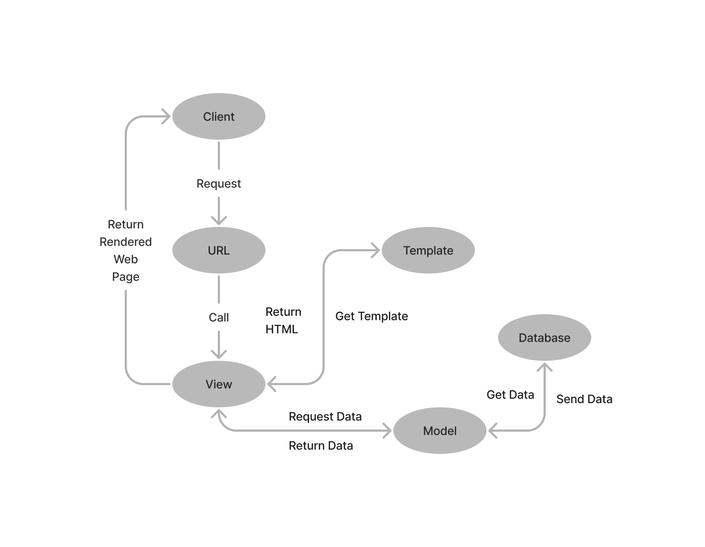
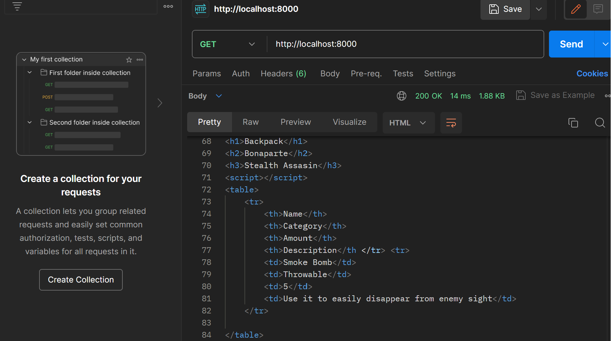
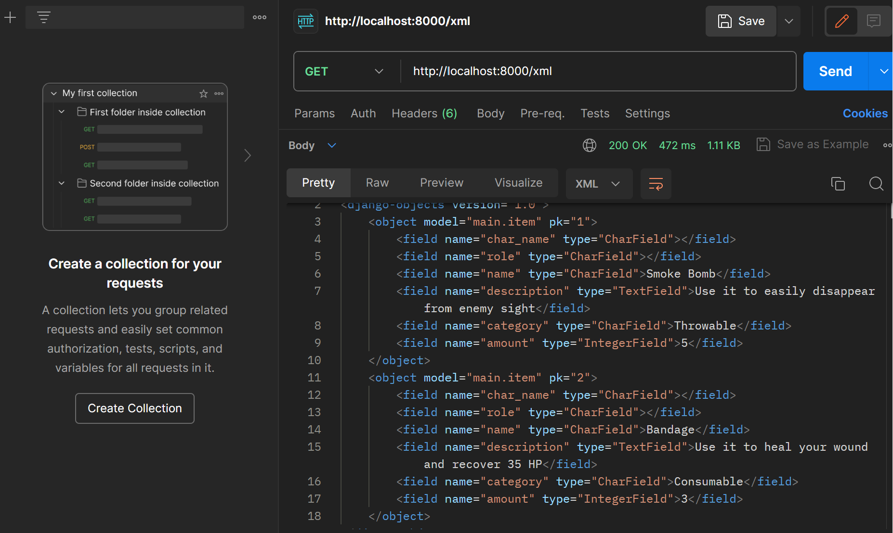
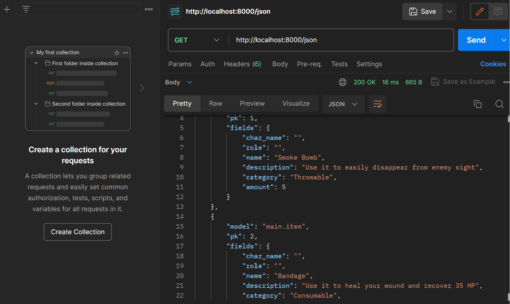
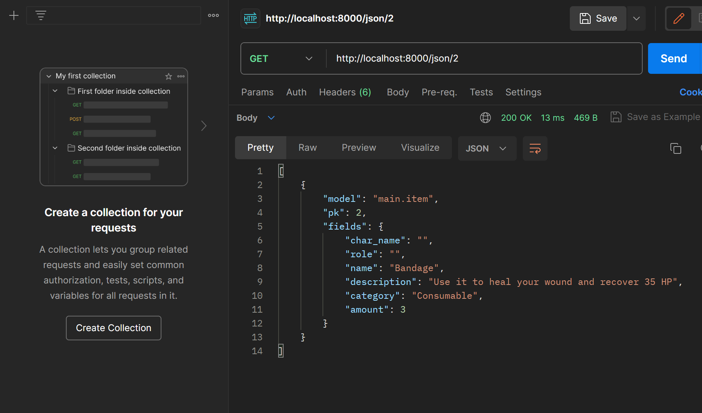

# Quest99

Tautan menuju aplikasi adaptable Quest99 bisa diakses melalui [tautan ini](ristek.link/Quest99).

## **Membuat proyek Django baru**

1. Buat folder baru dengan nama `Quest99` dan buka CMD(Command Promt)

2. Buat virtual environment dengan perintah `python -m venv env` untuk mengisolasi proyek Python kita dan aktifkan virtual environment dengan perintah `env\Scripts\activate.bat`

3. Buat file `requirements.txt` yang berisi apa saja yang dibutuhkan dalam membuat program dan nantinya akan digunakan sebagai catatan untuk installer. Lalu install pada CMD yang sudah dalam mode virtual environment dengan command `pip install -r requirements.txt`.

4. Buat proyek Django dengan menjalankan perintah `django-admin startproject (nama project) .` Atau dengn `python -m django startproject (nama project)` (Kemarin saya gagal menggunakan `django-admin` dan diajarkan menggunakan ini).  Nama project disesuaikan dengan keinginan, dan ini akan membuat folder baru dengan nama tersebut.

5. Buka file `settings.py` yang ada di dalam folder proyek, cari variabel `ALLOWED_HOSTS` dan ubah nilainya menjadi `["*"]` untuk mengizinkan akses dari semua host.

6. Kembali ke CMD atau terminal dan jalankan server dengan perintah `python manage.py runserver` di dalam folder proyek (pastikan ada file `manage.py` di dalam folder tempat membuka CMD).

7. Proyek Django baru dapat dibuka di browser dengan mengakses http://localhost:8000. Animasi roket menandakan proyek Django sudah berhasil.

8. Tekan `Ctrl+C` di CMD atau terminal untuk mematikan server. Gunakan command `deactivate` untuk mematikan virtual environment, atau dapat juga dengan menutup CMD.

9. Buat file `.gitignore` dan `add`,`commit`,dan `push` proyek ke github untuk menyimpan  yang telah dibuat sejauh ini.

## **Cara membuat aplikasi dengan nama `main` pada proyek**

1. Masih pada CMD, Jalankan perintah `python manage.py startapp main` untuk membuat folder baru bernama `main`.

2. Dendaftarkan aplikasi `main` ke proyek dengan membuka file `settings.py` dalam folder proyek dan tambahkan `'main'` pada variabel `INSTALLED_APPS`.

## **Cara membuat model pada aplikasi `main`**

1. Buka file `models.py` dan isi file tersebut dengan nama `Item` dan atribut-atribut dan tipe data yang ingin digunakan. Dalam program ini, ada 3 atribut wajib (name, amount, description) dan 3 atribut tambahan (category,char_name, dan role).

```py
class Item(models.Model):
    char_name = models.CharField(max_length=255, default='Bonaparte')
    role = models.CharField(max_length=255, default='Stealth Assasin')
    name = models.CharField(max_length=255)
    description = models.TextField()
    category = models.CharField(max_length=255)
    amount = models.IntegerField()
```

2. Jalankan perintah `python manage.py makemigrations` untuk mempersiapkan migrasi skema model ke dalam database Django lokal.

3. Jalankan perintah `python manage.py migrate` untuk menerapkan skema model yang telah dibuat ke dalam database Django lokal.

> [!IMPORTANT]
> Setiap kali ada perubahan pada model (menambahkan / mengurangi / mengganti atribut), wajib untuk melakukan migrasi untuk merefleksikan perubahan itu

## **Cara membuat sebuah fungsi pada views.py untuk dikembalikan ke dalam sebuah template HTML**

1. Buat folder baru bernama `templates` di dalam folder aplikasi `main` dan buat file `main.html` di dalamnya

2. Buka file `views.py` dalam folder `main` dan tambahkan `from django.shortcuts import render` untuk mengimpor fungsi render dari modul django.shortcuts untuk me-render tampilan HTML dengan menggunakan data yang diberikan.

```py
from django.shortcuts import render
```

3. Buat fungsi `show_main` dengan 1 parameter (anggap namanya `request`) dan di dalam fungsinya, buat sebuah dictionary yang berisi data yang akan dikirimkan ke tampilan yang kemudian di return dengan fungsi `render` dengan 3 argumennya, yaitu `request` (objek permintaan HTTP yang dikirim oleh pengguna), nama file html yang digunakan untuk me-_render_ tampilan, dan `context` (dictionary yang berisi data untuk digunakan dalam penampilan dinamis). Berikut adalah contohnya.

```py
def show_main(request):
    context = {
        'name': 'Smoke Bomb',
        'description': 'Use it to easily dissapear from enemy sight ',
        'category': 'Throwable',
        'amount': 5,
    }

    return render(request, "main.html", context)
```

4. Buka file `main.html` tadi dan ubah kode yang sebelumnya dibuat secara statis menjadi kode Django yang sesuai untuk menampilkan data. Gunakan sintaksis Django yang menggunakan tanda kurung ganda ganda `({{ }})` untuk memasukkan data dari dictionary data yang dikirimkan oleh fungsi `show_main`

## **Cara membuat sebuah routing pada urls.py aplikasi `main` untuk memetakan fungsi yang telah dibuat pada views.py**

1. Buat file `urls.py` di dalam folder `main` (jika belum ada) dan import modul path dari `django.urls` dan juga import views yang telah dibuat sebelumnya di `views.py`.

```py
from django.urls import path
from main.views import show_main
```

2. Tambahkan urlpatterns untuk menghubungkan path dengan fungsi yang telah Anda buat di `views.py`, yaitu `show_main`

```py
app_name = 'main'

urlpatterns = [
    path('', show_main, name='show_main'),
]
```

## **Cara melakukan routing pada proyek agar dapat menjalankan aplikasi `main`**

1. Buka file `urls.py` di dalam folder proyek `quest99` dan import modul `include` dari `django.urls` (`from django.urls import path, include`) untuk melakukan konfigurasi routing tampilan `main`

2. Di dalam variabel urlpatterns, tambahkan path yang akan mengarahkan ke aplikasi 'main', bisa menggunakan `include()` untuk menghubungkan ke file `urls.py` di aplikasi 'main'.

```python
urlpatterns = [
    path('admin/', admin.site.urls),
    path('main/', include('main.urls')),
    path('', include('main.urls')),
]
```

## **Cara _deployment_ aplikasi ke Adaptable**

1. Setelah login, pilih "New App" dan "Connect an Existing Repository".

2. Hubungkan Adaptable.io dengan GitHub, pilih "All Repositories" (jika baru pertama kali menghubungkan).

3. Pilih repositori proyek aplikasi yang telah diunggah ke github dan branch untuk _deployment_.

4. Pilih template deployment "Python App Template" dan pilih PostgreSQL sebagai tipe basis data.

5. Sesuaikan versi Python dengan yang dibutuhkan (cek menggunakan perintah `python --version` pada command prompt).

6. Isi Start Command dengan `python manage.py migrate && gunicorn (nama folder utama).wsgi`.

7. Tentukan nama aplikasi yang juga akan menjadi nama domain situs web.

8. Centang "HTTP Listener on PORT" dan klik "Deploy App" untuk memulai proses deployment aplikasi.

## **Bagan yang berisi request client ke web aplikasi berbasis Django beserta responnya**


Dalam web aplikasi Django, ketika client mengirimkan permintaan HTTP, Django menggunakan file `urls.py` `views.py` mengatur logika aplikasi, termasuk interaksi dengan models dalam `models.py`. Data yang diperlukan untuk merender tampilan dikumpulkan dalam view, dan hasilnya dirender menggunakan file HTML. File HTML mengandung kode HTML dan tag-template Django untuk memasukkan data dari view. Setelah selesai dirender, tampilan tersebut dikirim sebagai respon ke client, membentuk aliran pengembangan yang terstruktur dalam Django: `urls.py` mengelola routing, `views.py` mengatur logika, `models.py` mengelola data, dan file HTML mengontrol tampilan, menciptakan aplikasi web yang berfungsi dengan baik.

## **Mengapa kita menggunakan virtual environment?**

Agar kebutuhan (dependencies) yang dibutuhkan python dan django hanya berlaku pada virtual enviroment tersebut tanpa mengganggu folder maupun file lain pada perangkat yang kita gunakan.

## **Apakah kita tetap dapat membuat aplikasi web berbasis Django tanpa menggunakan virtual environment?**

Ya, web tetap dapat terbuat.

Namun terdapat beberapa kendala seperti file di perangkat berantakan, antar file ada peluang bertabrakan satu sama lain, hingga ketidakstabilan program karena terganggu dengan adanya program lain.

## **Jelaskan apakah itu MVC, MVT, MVVM dan perbedaan dari ketiganya**

### MVC (Model - View - Controller)

Model = Menyimpan Aplikasi data (logika dan hubungan dengan database) tanpa mengetahui  interface (tampilan) sama sekali.

View = UI (User Interface ) yang bertugas menampilkan data ke layar.

Controller = Menjadi penghubung antara Model dan View dari mulai menerima input, memprosesnya, hingga mengupdate `Model` dan `View`.

### MVT (Model - View - Template)
Model = Mengelola data dan logika tanpa mengetahui tampilan.

View = Menampilkan data ke pengguna.

Template = Menentukkan tampilan dari `View`

### MVVM (Model - View - ViewModel)
Model = Mengelola data dan logika tanpa mengetahui tampilan.

View = Menampilkan data ke pengguna.

ViewModel = Mengelola tampilan dan logika tampilan yang terkait dengan `View`.
### Perbedaan MVC, MVT, dan MVVM

MVC memegang fungsi masing - masing dalam menampilkan program. Controller berperan penting dalam mengontrol aliran `Model` dan `View`. MVC sendiri tidak berbeda jauh dengan MVC hanya saja `Template` memegang kendali dalam menentukkan tampilan. Sedangkan MVVM memisahkan `View` dari `Model` sehingga fokus pada tampilan dan logika serta tampilan khusus diurus `ViewModel` 


## **Cara mengimplementasikan _Skeleton_ sebagai Kerangka Views**
1. Buat folder bernama `templates` di dalam root folder dan buatlah file bernama `base.html`. Isi file tersebut dengan kode di bawah ini.
```html

<!DOCTYPE html>
<html lang="en">
    <head>
        <meta charset="UTF-8" />
        <meta
            name="viewport"
            content="width=device-width, initial-scale=1.0"
        />
        
        
    </head>

    <body>
        
        
    </body>
</html>
```
2. Buka `settings.py` pada subdirektori `quest99` dan cari variabel `TEMPLATES` yang bertipe data list of dictionaries, kemudian sesuaikan value dari key `DIRS` untuk mengarahkan ke folder `templates` yang telah dibuat sebelumnya.
```py
TEMPLATES = [
    {
        ...
        'DIRS': [BASE_DIR / 'templates'],
        ...
    }
]
```
3. Pada `main/templates/main.html`, tambahkan kode di bawah ini untuk meng-_extend_ dari `base.html` yang baru saja dibuat.
```html


    ...
    //kode html yang telah dibuat sebelumnya
    ...

```

## **Cara membuat input form untuk menambahkan objek model pada aplikasi**
1. Jalankan virtual environment terlebih dahulu. Untuk windows, menggunakan command `env\Scripts\activate.bat` dan untuk unix menggunakan command `source env/bin/activate`

2. Kita implementasikan dahulu sebuah skeleton sebagai kerangka viewsnya. Untuk tata caranya, silahkan mengikuti [link ini](#cara-mengimplementasikan-skeleton-sebagai-kerangka-views)

3. Buat file terbaru, yaitu `forms.py` pada folder `main` yang bertujuan untuk membuat struktur form yang dapat menerima data produk baru saat diinput, dan tambahkan kode di bawah ini
```py
from django.forms import ModelForm
from main.models import Item

class ItemForm(ModelForm):
    class Meta:
        model = Item
        fields = ["name","description", "category", "amount"]
```
> [!NOTE]
> isi variabel `fields` disesuaikan dengan informasi / variabel apa saja yang ingin diminta dari user

4. Buka file `main/views.py` dan tambahkan beberapa import serta function `create_item` untuk menghasilkan form yang dapat menambahkan data produk secara otomatis ketika data di-_submit_ dari form
```py
from django.http import HttpResponseRedirect
from main.forms import ItemForm
from django.urls import reverse
...
def create_item(request):
    form = ItemForm(request.POST or None)

    if form.is_valid() and request.method == "POST":
        form.save()
        return HttpResponseRedirect(reverse('main:show_main'))

    context = {'form': form}
    return render(request, "create_item.html", context)
```

## **Cara menambahkan fungsi views untuk melihat objek yang sudah ditambahkan (HTML, XML, JSON, XML by ID, dan JSON by ID)**
### **HTML**
1. Pada file `main/views.py`, ubah function `show_main` untuk mengambil seluruh object Item yang tersimpan pada database
```py
def show_main(request):

    item = Item.objects.all()
    context = {
        'char_name' : 'Bonaparte',
        'role': 'Stealth Assasin',
        'items': item
    }
    
    

    return render(request, "main.html", context)
```

2. Buka `main/urls.py`, lalu import function `create_item` yang sudah dibuat tadi dan tambahkan path url ke dalam url patterns untuk mengakses function tadi.
```py
from main.views import show_main, create_item
...
urlpatterns = [
    ...
    path('create-item', create_item, name='create_item'),
]
```

3. Buat file `create_item.html` di dalam folder `main/templates` yang berfungsi sebagai tampilan form untuk meminta input data. Berikut adalah isi dari filenya.
```py
 


<h1>Add New Item</h1>

<form method="POST">
    
    <table>
        {{ form.as_table }}
        <tr>
            <td></td>
            <td>
                <input type="submit" value="Add Item"/>
            </td>
        </tr>
    </table>
</form>


```

4. Buka `main.html` dalam folder `main/templates` dan tambahkan kode di dalam `` untuk menampilkan barang yang di-_input_ melalui `create_item.html` dalam bentuk tabel.
```html
...
<table>
    <tr>
        <th>Name</th>
        <th>Category</th>
        <th>Amount</th>
        <th>Description</th
    </tr>
    
    
        <tr>
            <td>{{ item.name }}</td>
            <td>{{ item.category }}</td>
            <td>{{ item.amount }}</td>
            <td>{{ item.description }}</td>
        </tr>
    
</table>
...
```
### **XML**
1. Buka file `main/views.py`, kemudian import `HttpResponse` dan `Serializer` dan tambahkan function `show_xml`
```py
from django.http import HttpResponse
from django.core import serializers
...
def show_xml(request):
    data = Item.objects.all()
    return HttpResponse(serializers.serialize("xml", data), content_type="application/xml")
```
> [!NOTE]
> serializers digunakan untuk translate objek model menjadi format lain.

2. Buka `main/urls.py` untuk import function `show_xml` dan tambahkan routing url ke url patterns sebagai akses menuju fungsi tersebut
```py
from main.views import show_main, create_item, show_xml
...
urlpatterns = [
    ...
    path('xml/', show_xml, name='show_xml'),
    ...
]
```

### **JSON**
1. Buka file `views.py` pada folder `main` dan buat fungsi `show_json` yang menerima parameter `request`
```py
def show_json(request):
    data = Item.objects.all()
    return HttpResponse(serializers.serialize("json", data), content_type="application/json")
```

2. Buka `urls.py` yang ada pada folder `main` dan import fungsi yang sudah dibuat tadi `(show_json)` dan tambahkan path url ke dalam urlpatterns untuk mengakses fungsi yang diimpor tadi
```py
from main.views import show_main, create_item, show_xml, show_json
...
urlpatterns = [
    ...
    path('json/', show_json, name='show_json'),
    ...
]
```

### **XML dan JSON by ID**
1. Buka kembali folder `main` dan akses file `urls.py`, kemudian buat function baru, `show_xml_by_id` dan `show_json_by_id` dengan mengembalikan function berupa `HttpResponse` yang berisi parameter data hasil query yang sudah diserialisasi menjadi JSON atau XML dan parameter `content_type`
```py
...
def show_xml_by_id(request, id):
    data = Item.objects.filter(pk=id)
    return HttpResponse(serializers.serialize("xml", data), content_type="application/xml")

def show_json_by_id(request, id):
    data = Item.objects.filter(pk=id)
    return HttpResponse(serializers.serialize("json", data), content_type="application/json")
...
```

2. Buka `urls.py` yang ada pada folder `main` dan import fungsi yang sudah dibuat tadi, yaitu `show_xml_by_id` dan `show_json_by_id`, kemudian perbarui path url yang di dalam urlpatterns untuk mengakses kedua fungsi tersebut.
```py
from django.urls import path
from main.views import show_main, create_item, show_xml, show_json, show_xml_by_id, show_json_by_id 

app_name = 'main'

urlpatterns = [
    path('', show_main, name='show_main'),
    path('create-item', create_item, name='create_item'),
    path('xml/', show_xml, name='show_xml'),
    path('json/', show_json, name='show_json'),
    path('xml/<int:id>/', show_xml_by_id, name='show_xml_by_id'),
    path('json/<int:id>/', show_json_by_id, name='show_json_by_id'),
]
```

## **Perbedaan antara form POST dan form GET dalam Django**
Tujuan utama dari `POST` adalah untuk mengirim data ke server agar diproses dan diperbaharui.`POST` juga dapat digunakan untuk menghapus sumber data yang ada pada server. Hal tersebut dapat saja mengubah keadaan server.

Sedangkan `GET` memiliki tujuan utama mengambil data dari server. Saat kita mengajukan `GET` kita meminta server mengembalikan informasi sesuai yang kita minta. Hal tersebut tidak mengubah apapun dari server.

## **Perbedaan utama antara XML, JSON, dan HTML dalam konteks pengiriman data**
1. Tujuan
    XML(eXtensible Markup Language) adalah salah satu bahasa pemrograman yang di desain untuk menyimpan dan mengangkut data. Sedangkan JSON(JavaScript Object Notation) adalah format pertukaran data yang ringan yang umumnya digunakan agar terbaca oleh manusia. Dan HTML(Hypertext Markup Language) adalah salah satu bahasa pemrograman yang ditujukan untuk membuat struktur dari sebuah laman web

2. Syntax
    XML : 
    ```xml
    <person>
    <name>Alice Johnson</name>
    <age>25</age>
    <address>
        <street>123 Main St</street>
        <city>Los Angeles</city>
        <zip>90001</zip>
    </address>
    </person>
    ```

    JSON:
    ```json
    {
    "name": "Alice Johnson",
    "age": 25,
    "address": {
        "street": "123 Main St",
        "city": "Los Angeles",
        "zip": "90001"
    }
    }
    ```

    HTML: Karena HTML berfokus pada web, HTML umumnya tidak didesain untuk menyimpan data.

## **Mengapa JSON sering digunakan dalam pertukaran data antara aplikasi web modern?**
1. Karena ringan dan kecilnya ukuran data. Sehingga membuat transfer data lebih efisien.
2. Dapat terbaca oleh manusia dengan mudah (human-readable).
3. Mudah dimengerti aplikasi web.
4. Keamanan yang lebih terjaga karena tidak memungkinkan untuk eksekusi kode.
5. Dapat menyimpan berbagai tipe data.

## **Screenshot hasil akses URL pada Postman**
### **HTML**


### **XML**


### **JSON**


### **XML by ID**


### **JSON by ID**
