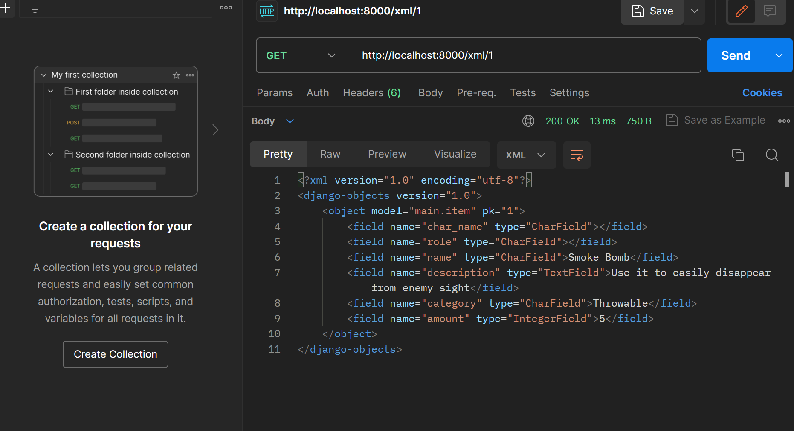

# Quest99

Tautan menuju aplikasi adaptable Quest99 bisa diakses melalui [tautan ini](ristek.link/Quest99).
Link(natanael-bonaparte-tugas.pbp.cs.ui.ac.id)

## **Membuat proyek Django baru**

1. Buat folder baru dengan nama `Quest99` dan buka CMD(Command Promt)

2. Buat virtual environment dengan perintah `python -m venv env` untuk mengisolasi proyek Python kita dan aktifkan virtual environment dengan perintah `env\Scripts\activate.bat`

3. Buat file `requirements.txt` yang berisi apa saja yang dibutuhkan dalam membuat program dan nantinya akan digunakan sebagai catatan untuk installer. Lalu install pada CMD yang sudah dalam mode virtual environment dengan command `pip install -r requirements.txt`.

4. Buat proyek Django dengan menjalankan perintah `django-admin startproject (nama project) .` Atau dengn `python -m django startproject (nama project)` (Kemarin saya gagal menggunakan `django-admin` dan diajarkan menggunakan ini).  Nama project disesuaikan dengan keinginan, dan ini akan membuat folder baru dengan nama tersebut.

5. Buka file `settings.py` yang ada di dalam folder proyek, cari variabel `ALLOWED_HOSTS` dan ubah nilainya menjadi `["*"]` untuk mengizinkan akses dari semua host.

6. Kembali ke CMD atau terminal dan jalankan server dengan perintah `python manage.py runserver` di dalam folder proyek (pastikan ada file `manage.py` di dalam folder tempat membuka CMD).

7. Proyek Django baru dapat dibuka di browser dengan mengakses http://localhost:8000. Animasi roket menandakan proyek Django sudah berhasil.

8. Tekan `Ctrl+C` di CMD atau terminal untuk mematikan server. Gunakan command `deactivate` untuk mematikan virtual environment, atau dapat juga dengan menutup CMD.

9. Buat file `.gitignore` dan `add`,`commit`,dan `push` proyek ke github untuk menyimpan  yang telah dibuat sejauh ini.

## **Cara membuat aplikasi dengan nama `main` pada proyek**

1. Masih pada CMD, Jalankan perintah `python manage.py startapp main` untuk membuat folder baru bernama `main`.

2. Dendaftarkan aplikasi `main` ke proyek dengan membuka file `settings.py` dalam folder proyek dan tambahkan `'main'` pada variabel `INSTALLED_APPS`.

## **Cara membuat model pada aplikasi `main`**

1. Buka file `models.py` dan isi file tersebut dengan nama `Item` dan atribut-atribut dan tipe data yang ingin digunakan. Dalam program ini, ada 3 atribut wajib (name, amount, description) dan 3 atribut tambahan (category,char_name, dan role).

```py
class Item(models.Model):
    char_name = models.CharField(max_length=255, default='Bonaparte')
    role = models.CharField(max_length=255, default='Stealth Assasin')
    name = models.CharField(max_length=255)
    description = models.TextField()
    category = models.CharField(max_length=255)
    amount = models.IntegerField()
```

2. Jalankan perintah `python manage.py makemigrations` untuk mempersiapkan migrasi skema model ke dalam database Django lokal.

3. Jalankan perintah `python manage.py migrate` untuk menerapkan skema model yang telah dibuat ke dalam database Django lokal.

> [!IMPORTANT]
> Setiap kali ada perubahan pada model (menambahkan / mengurangi / mengganti atribut), wajib untuk melakukan migrasi untuk merefleksikan perubahan itu

## **Cara membuat sebuah fungsi pada views.py untuk dikembalikan ke dalam sebuah template HTML**

1. Buat folder baru bernama `templates` di dalam folder aplikasi `main` dan buat file `main.html` di dalamnya

2. Buka file `views.py` dalam folder `main` dan tambahkan `from django.shortcuts import render` untuk mengimpor fungsi render dari modul django.shortcuts untuk me-render tampilan HTML dengan menggunakan data yang diberikan.

```py
from django.shortcuts import render
```

3. Buat fungsi `show_main` dengan 1 parameter (anggap namanya `request`) dan di dalam fungsinya, buat sebuah dictionary yang berisi data yang akan dikirimkan ke tampilan yang kemudian di return dengan fungsi `render` dengan 3 argumennya, yaitu `request` (objek permintaan HTTP yang dikirim oleh pengguna), nama file html yang digunakan untuk me-_render_ tampilan, dan `context` (dictionary yang berisi data untuk digunakan dalam penampilan dinamis). Berikut adalah contohnya.

```py
def show_main(request):
    context = {
        'name': 'Smoke Bomb',
        'description': 'Use it to easily dissapear from enemy sight ',
        'category': 'Throwable',
        'amount': 5,
    }

    return render(request, "main.html", context)
```

4. Buka file `main.html` tadi dan ubah kode yang sebelumnya dibuat secara statis menjadi kode Django yang sesuai untuk menampilkan data. Gunakan sintaksis Django yang menggunakan tanda kurung ganda ganda `({{ }})` untuk memasukkan data dari dictionary data yang dikirimkan oleh fungsi `show_main`

## **Cara membuat sebuah routing pada urls.py aplikasi `main` untuk memetakan fungsi yang telah dibuat pada views.py**

1. Buat file `urls.py` di dalam folder `main` (jika belum ada) dan import modul path dari `django.urls` dan juga import views yang telah dibuat sebelumnya di `views.py`.

```py
from django.urls import path
from main.views import show_main
```

2. Tambahkan urlpatterns untuk menghubungkan path dengan fungsi yang telah Anda buat di `views.py`, yaitu `show_main`

```py
app_name = 'main'

urlpatterns = [
    path('', show_main, name='show_main'),
]
```

## **Cara melakukan routing pada proyek agar dapat menjalankan aplikasi `main`**

1. Buka file `urls.py` di dalam folder proyek `quest99` dan import modul `include` dari `django.urls` (`from django.urls import path, include`) untuk melakukan konfigurasi routing tampilan `main`

2. Di dalam variabel urlpatterns, tambahkan path yang akan mengarahkan ke aplikasi 'main', bisa menggunakan `include()` untuk menghubungkan ke file `urls.py` di aplikasi 'main'.

```python
urlpatterns = [
    path('admin/', admin.site.urls),
    path('main/', include('main.urls')),
    path('', include('main.urls')),
]
```

## **Cara _deployment_ aplikasi ke Adaptable**

1. Setelah login, pilih "New App" dan "Connect an Existing Repository".

2. Hubungkan Adaptable.io dengan GitHub, pilih "All Repositories" (jika baru pertama kali menghubungkan).

3. Pilih repositori proyek aplikasi yang telah diunggah ke github dan branch untuk _deployment_.

4. Pilih template deployment "Python App Template" dan pilih PostgreSQL sebagai tipe basis data.

5. Sesuaikan versi Python dengan yang dibutuhkan (cek menggunakan perintah `python --version` pada command prompt).

6. Isi Start Command dengan `python manage.py migrate && gunicorn (nama folder utama).wsgi`.

7. Tentukan nama aplikasi yang juga akan menjadi nama domain situs web.

8. Centang "HTTP Listener on PORT" dan klik "Deploy App" untuk memulai proses deployment aplikasi.

## **Bagan yang berisi request client ke web aplikasi berbasis Django beserta responnya**


Dalam web aplikasi Django, ketika client mengirimkan permintaan HTTP, Django menggunakan file `urls.py` `views.py` mengatur logika aplikasi, termasuk interaksi dengan models dalam `models.py`. Data yang diperlukan untuk merender tampilan dikumpulkan dalam view, dan hasilnya dirender menggunakan file HTML. File HTML mengandung kode HTML dan tag-template Django untuk memasukkan data dari view. Setelah selesai dirender, tampilan tersebut dikirim sebagai respon ke client, membentuk aliran pengembangan yang terstruktur dalam Django: `urls.py` mengelola routing, `views.py` mengatur logika, `models.py` mengelola data, dan file HTML mengontrol tampilan, menciptakan aplikasi web yang berfungsi dengan baik.

## **Mengapa kita menggunakan virtual environment?**

Agar kebutuhan (dependencies) yang dibutuhkan python dan django hanya berlaku pada virtual enviroment tersebut tanpa mengganggu folder maupun file lain pada perangkat yang kita gunakan.

## **Apakah kita tetap dapat membuat aplikasi web berbasis Django tanpa menggunakan virtual environment?**

Ya, web tetap dapat terbuat.

Namun terdapat beberapa kendala seperti file di perangkat berantakan, antar file ada peluang bertabrakan satu sama lain, hingga ketidakstabilan program karena terganggu dengan adanya program lain.

## **Jelaskan apakah itu MVC, MVT, MVVM dan perbedaan dari ketiganya**

### MVC (Model - View - Controller)

Model = Menyimpan Aplikasi data (logika dan hubungan dengan database) tanpa mengetahui  interface (tampilan) sama sekali.

View = UI (User Interface ) yang bertugas menampilkan data ke layar.

Controller = Menjadi penghubung antara Model dan View dari mulai menerima input, memprosesnya, hingga mengupdate `Model` dan `View`.

### MVT (Model - View - Template)
Model = Mengelola data dan logika tanpa mengetahui tampilan.

View = Menampilkan data ke pengguna.

Template = Menentukkan tampilan dari `View`

### MVVM (Model - View - ViewModel)
Model = Mengelola data dan logika tanpa mengetahui tampilan.

View = Menampilkan data ke pengguna.

ViewModel = Mengelola tampilan dan logika tampilan yang terkait dengan `View`.
### Perbedaan MVC, MVT, dan MVVM

MVC memegang fungsi masing - masing dalam menampilkan program. Controller berperan penting dalam mengontrol aliran `Model` dan `View`. MVC sendiri tidak berbeda jauh dengan MVC hanya saja `Template` memegang kendali dalam menentukkan tampilan. Sedangkan MVVM memisahkan `View` dari `Model` sehingga fokus pada tampilan dan logika serta tampilan khusus diurus `ViewModel` 


## **Cara mengimplementasikan _Skeleton_ sebagai Kerangka Views**
1. Buat folder bernama `templates` di dalam root folder dan buatlah file bernama `base.html`. Isi file tersebut dengan kode di bawah ini.
```html

<!DOCTYPE html>
<html lang="en">
    <head>
        <meta charset="UTF-8" />
        <meta
            name="viewport"
            content="width=device-width, initial-scale=1.0"
        />
        
        
    </head>

    <body>
        
        
    </body>
</html>
```
2. Buka `settings.py` pada subdirektori `quest99` dan cari variabel `TEMPLATES` yang bertipe data list of dictionaries, kemudian sesuaikan value dari key `DIRS` untuk mengarahkan ke folder `templates` yang telah dibuat sebelumnya.
```py
TEMPLATES = [
    {
        ...
        'DIRS': [BASE_DIR / 'templates'],
        ...
    }
]
```
3. Pada `main/templates/main.html`, tambahkan kode di bawah ini untuk meng-_extend_ dari `base.html` yang baru saja dibuat.
```html


    ...
    //kode html yang telah dibuat sebelumnya
    ...

```

## **Cara membuat input form untuk menambahkan objek model pada aplikasi**
1. Jalankan virtual environment terlebih dahulu.

2. Implementasikan dahulu sebuah skeleton sebagai kerangka viewsnya. 

3. Buat file terbaru, yaitu `forms.py` pada folder `main` yang bertujuan untuk membuat struktur form yang dapat menerima data produk baru saat diinput, dan tambahkan kode di bawah ini
```py
from django.forms import ModelForm
from main.models import Item

class ItemForm(ModelForm):
    class Meta:
        model = Item
        fields = ["name","description", "category", "amount"]
```

4. Buka file `main/views.py` dan tambahkan beberapa import serta function `create_item` untuk menghasilkan form yang dapat menambahkan data produk secara otomatis ketika data di-_submit_ dari form
```py
from django.http import HttpResponseRedirect
from main.forms import ItemForm
from django.urls import reverse
...
def create_item(request):
    form = ItemForm(request.POST or None)

    if form.is_valid() and request.method == "POST":
        form.save()
        return HttpResponseRedirect(reverse('main:show_main'))

    context = {'form': form}
    return render(request, "create_item.html", context)
```

## **Cara menambahkan fungsi views untuk melihat objek yang sudah ditambahkan (HTML, XML, JSON, XML by ID, dan JSON by ID)**
### **HTML**
1. Pada file `main/views.py`, ubah function `show_main` untuk mengambil seluruh object Item yang tersimpan pada database
```py
def show_main(request):

    item = Item.objects.all()
    context = {
        'char_name' : 'Bonaparte',
        'role': 'Stealth Assasin',
        'items': item
    }
    
    

    return render(request, "main.html", context)
```

2. Buka `main/urls.py`, lalu import function `create_item` yang sudah dibuat tadi dan tambahkan path url ke dalam url patterns untuk mengakses function tadi.
```py
from main.views import show_main, create_item
...
urlpatterns = [
    ...
    path('create-item', create_item, name='create_item'),
]
```

3. Buat file `create_item.html` di dalam folder `main/templates` yang berfungsi sebagai tampilan form untuk meminta input data. Berikut adalah isi dari filenya.
```py
 


<h1>Add New Item</h1>

<form method="POST">
    
    <table>
        {{ form.as_table }}
        <tr>
            <td></td>
            <td>
                <input type="submit" value="Add Item"/>
            </td>
        </tr>
    </table>
</form>


```

4. Buka `main.html` dalam folder `main/templates` dan tambahkan kode di dalam `` untuk menampilkan barang yang di-_input_ melalui `create_item.html` dalam bentuk tabel.
```html
...
<table>
    <tr>
        <th>Name</th>
        <th>Category</th>
        <th>Amount</th>
        <th>Description</th
    </tr>
    
    
        <tr>
            <td>{{ item.name }}</td>
            <td>{{ item.category }}</td>
            <td>{{ item.amount }}</td>
            <td>{{ item.description }}</td>
        </tr>
    
</table>
...
```
### **XML**
1. Buka file `main/views.py`, kemudian import `HttpResponse` dan `Serializer` dan tambahkan function `show_xml`
```py
from django.http import HttpResponse
from django.core import serializers
...
def show_xml(request):
    data = Item.objects.all()
    return HttpResponse(serializers.serialize("xml", data), content_type="application/xml")
```
> [!NOTE]
> serializers digunakan untuk translate objek model menjadi format lain.

2. Buka `main/urls.py` untuk import function `show_xml` dan tambahkan routing url ke url patterns sebagai akses menuju fungsi tersebut
```py
from main.views import show_main, create_item, show_xml
...
urlpatterns = [
    ...
    path('xml/', show_xml, name='show_xml'),
    ...
]
```

### **JSON**
1. Buka file `views.py` pada folder `main` dan buat fungsi `show_json` yang menerima parameter `request`
```py
def show_json(request):
    data = Item.objects.all()
    return HttpResponse(serializers.serialize("json", data), content_type="application/json")
```

2. Buka `urls.py` yang ada pada folder `main` dan import fungsi yang sudah dibuat tadi `(show_json)` dan tambahkan path url ke dalam urlpatterns untuk mengakses fungsi yang diimpor tadi
```py
from main.views import show_main, create_item, show_xml, show_json
...
urlpatterns = [
    ...
    path('json/', show_json, name='show_json'),
    ...
]
```

### **XML dan JSON by ID**
1. Buka kembali folder `main` dan akses file `urls.py`, kemudian buat function baru, `show_xml_by_id` dan `show_json_by_id` dengan mengembalikan function berupa `HttpResponse` yang berisi parameter data hasil query yang sudah diserialisasi menjadi JSON atau XML dan parameter `content_type`
```py
...
def show_xml_by_id(request, id):
    data = Item.objects.filter(pk=id)
    return HttpResponse(serializers.serialize("xml", data), content_type="application/xml")

def show_json_by_id(request, id):
    data = Item.objects.filter(pk=id)
    return HttpResponse(serializers.serialize("json", data), content_type="application/json")
...
```

2. Buka `urls.py` yang ada pada folder `main` dan import fungsi yang sudah dibuat tadi, yaitu `show_xml_by_id` dan `show_json_by_id`, kemudian perbarui path url yang di dalam urlpatterns untuk mengakses kedua fungsi tersebut.
```py
from django.urls import path
from main.views import show_main, create_item, show_xml, show_json, show_xml_by_id, show_json_by_id 

app_name = 'main'

urlpatterns = [
    path('', show_main, name='show_main'),
    path('create-item', create_item, name='create_item'),
    path('xml/', show_xml, name='show_xml'),
    path('json/', show_json, name='show_json'),
    path('xml/<int:id>/', show_xml_by_id, name='show_xml_by_id'),
    path('json/<int:id>/', show_json_by_id, name='show_json_by_id'),
]
```

## **Perbedaan antara form POST dan form GET dalam Django**
Tujuan utama dari `POST` adalah untuk mengirim data ke server agar diproses dan diperbaharui.`POST` juga dapat digunakan untuk menghapus sumber data yang ada pada server. Hal tersebut dapat saja mengubah keadaan server.

Sedangkan `GET` memiliki tujuan utama mengambil data dari server. Saat kita mengajukan `GET` kita meminta server mengembalikan informasi sesuai yang kita minta. Hal tersebut tidak mengubah apapun dari server.

## **Perbedaan utama antara XML, JSON, dan HTML dalam konteks pengiriman data**
1. Tujuan
    XML(eXtensible Markup Language) adalah salah satu bahasa pemrograman yang di desain untuk menyimpan dan mengangkut data. Sedangkan JSON(JavaScript Object Notation) adalah format pertukaran data yang ringan yang umumnya digunakan agar terbaca oleh manusia. Dan HTML(Hypertext Markup Language) adalah salah satu bahasa pemrograman yang ditujukan untuk membuat struktur dari sebuah laman web

2. Syntax
    XML : 
    ```xml
    <person>
    <name>Alice Johnson</name>
    <age>25</age>
    <address>
        <street>123 Main St</street>
        <city>Los Angeles</city>
        <zip>90001</zip>
    </address>
    </person>
    ```

    JSON:
    ```json
    {
    "name": "Alice Johnson",
    "age": 25,
    "address": {
        "street": "123 Main St",
        "city": "Los Angeles",
        "zip": "90001"
    }
    }
    ```

    HTML: Karena HTML berfokus pada web, HTML umumnya tidak didesain untuk menyimpan data.

## **Mengapa JSON sering digunakan dalam pertukaran data antara aplikasi web modern?**
1. Karena ringan dan kecilnya ukuran data. Sehingga membuat transfer data lebih efisien.
2. Dapat terbaca oleh manusia dengan mudah (human-readable).
3. Mudah dimengerti aplikasi web.
4. Keamanan yang lebih terjaga karena tidak memungkinkan untuk eksekusi kode.
5. Dapat menyimpan berbagai tipe data.

## **Screenshot hasil akses URL pada Postman**
### **HTML**


### **XML**


### **JSON**


### **XML by ID**


### **JSON by ID**


## **Membuat Fungsi dan Form Registrasi**

1. Pastikan virtual environment (env) sudah aktif
2. Buka `views.py` pada subdirektori `main` lalu masukan import dibawah ini
```py
from django.shortcuts import redirect
from django.contrib.auth.forms import UserCreationForm
from django.contrib import messages
```

3. Tambahkan fungsi register

```py
def register(request):
    form = UserCreationForm()

    if request.method == "POST":
        form = UserCreationForm(request.POST)
        if form.is_valid():
            form.save()
            messages.success(request, 'Your account has been successfully created!')
            return redirect('main:login')
    context = {'form':form}
    return render(request, 'register.html', context)
```

4. Buatlah file baru dengan nama `register.html` pada folder `main/templates` dan isi dengan

```py



    <title>Register</title>


  

<div class = "login">
    
    <h1>Register</h1>  

        <form method="POST" >  
              
            <table>  
                {{ form.as_table }}  
                <tr>  
                    <td></td>
                    <td><input type="submit" name="submit" value="Daftar"/></td>  
                </tr>  
            </table>  
        </form>

      
        <ul>   
              
                <li>{{ message }}</li>  
                  
        </ul>   
    

</div>  


```

5. Buka `urls.py` pada subdirektori `main`, lalu import 

```py
from main.views import register #pastikan import sesuai dengan fungsi yang sudah anda buat
```

6. Lalu, tambahkan path url ini pada `urls.py`
```py
path('register/', register, name='register'), #Sesuaikan dengan fungsi yang sudah anda buat
```

## **Membuat Fungsi Login**

1. Buka `views.py` pada subdirektori `main` lalu tambah import dibawah ini
```py
from django.contrib.auth import authenticate, login
```

2. Tambahkan fungsi login
```py
def login_user(request):
    if request.method == 'POST':
        username = request.POST.get('username')
        password = request.POST.get('password')
        user = authenticate(request, username=username, password=password)
        if user is not None:
            login(request, user)
            return redirect('main:show_main')
        else:
            messages.info(request, 'Sorry, incorrect username or password. Please try again.')
    context = {}
    return render(request, 'login.html', context)
```

3. Buatlah file baru dengan nama `login.html` pada folder `main/templates`dan isi kode ini
```py



    <title>Login</title>




<div class = "login">

    <h1>Login</h1>

    <form method="POST" action="">
        
        <table>
            <tr>
                <td>Username: </td>
                <td><input type="text" name="username" placeholder="Username" class="form-control"></td>
            </tr>
                    
            <tr>
                <td>Password: </td>
                <td><input type="password" name="password" placeholder="Password" class="form-control"></td>
            </tr>

            <tr>
                <td></td>
                <td><input class="btn login_btn" type="submit" value="Login"></td>
            </tr>
        </table>
    </form>

    
        <ul>
            
                <li>{{ message }}</li>
            
        </ul>
         
        
    Don't have an account yet? <a href="">Register Now</a>

</div>


```

4. Buka `urls.py` pada subdirektori `main`, lalu tambah import ini
```py
from main.views import login_user #Sesuaikan dengan fungsi yang anda buat
```

5. Lalu, tambahkan path url ini pada `urls.py`
```py
path('login/', login_user, name='login'), #Sesuaikan dengan fungsi yang anda buat
```

## **Membuat Fungsi Logout**

1. Buka `views.py` pada subdirektori `main` lalu tambah import dibawah ini
```py
from django.contrib.auth import logout
```

2. Tambahkan fungsi logout
```py
def logout_user(request):
    logout(request)
    return redirect('main:login')
```

3. Lalu, buka file `main.html` pada folder `main/templates` lalu tambah kode ini di bawah
```py
...
<a href="">
    <button>
        Logout
    </button>
</a>
...
```

3. Buka `urls.py` pada subdirektori `main`, lalu tambah import ini
```PY
from main.views import logout_user
```

4. Lalu, tambahkan path url ini pada `urls.py`
```py
path('logout/', logout_user, name='logout'),
```

## **Merestriksi Akses Halaman**

1. Buka `views.py` pada subdirektori `main` lalu masukan import dibawah ini
```py
from django.contrib.auth.decorators import login_required
```

2. Tambahkan kode `@login_required(login_url='/login')` di atas fungsi `show_main`
```py
...
@login_required(login_url='/login')
def show_main(request):
...
```

## **Menggunakan Data Dari Cookies**

1. Jika sedang berada di halaman yang berisikan daftar produk, logout terlebih dahulu
2. Buka `views.py` pada subdirektori `main` lalu tambah import dibawah ini
```py
import datetime
from django.http import HttpResponseRedirect
from django.urls import reverse
```

3. Pada fungsi `login_user`, ganti kode yang ada pada blok `if user is not None` menjadi seperti ini
```py

if user is not None:
    login(request, user)
    response = HttpResponseRedirect(reverse("main:show_main")) 
    response.set_cookie('last_login', str(datetime.datetime.now()))
    return response
...
``` 
> [!NOTE]
>Hal ini dilakukan untuk menambahkan cookie yang bernama `last_login` untuk melihat kapan terakhir kali pengguna melakukan login

4. Pada fungsi `show_main`, tambahkan potongan kode `'last_login': request.COOKIES['last_login']` ke dalam `context`
```py
context = {
    ...
    'last_login': request.COOKIES['last_login'],
}
...
```

5. Ubah fungsi `logout_user` menjadi seperti ini
```py
def logout_user(request):
    logout(request)
    response = HttpResponseRedirect(reverse('main:login'))
    response.delete_cookie('last_login')
    return response
```

6. Buka file `main.html` pada folder `main/templates` dan masukan kode berikut
```py
<h5>Sesi terakhir login: {{ last_login }}</h5>
```

## **Django UserCreationForm:**
UserCreationForm adalah *built-in class* milik  Django yang digunakan untuk mengatur registrasi pengguna baru. Form ini berisi validasi untuk field seperti username, password1 (untuk password), dan password2 (untuk konfirmasi password).

(+) Kelebihan:
    1. Mudah digunakan karena sudah disediakan oleh Django.
    2. Memiliki validasi bawaan untuk kolom-kolom yang umum digunakan dalam pendaftaran.
    3. Memudahkan pembuatan halaman registrasi dengan cepat.

(-)Kekurangan:
    1. Tidak fleksibel untuk kebutuhan khusus. Jika Anda membutuhkan field tambahan atau validasi kustom, Anda mungkin harus memperluas atau menggantinya.
    2. Mungkin terlalu sederhana untuk aplikasi dengan kebutuhan pendaftaran yang kompleks.

## **Perbedaan Autentikasi dan Otorisasi dalam konteks Django**

### **Autentikasi**

Autentikasi adalah proses validasi atau pembuktian terhadap identitas atau kredensial yang hendak memasuki sebuah sistem. Dalam django dapat digunakan dengan mengimport django.contrib.auth yang memiliki sistem autentikasi bawaan. Modul ini menyertakan views, forms, dan models yang membantu dalam proses autentikasi, seperti login, logout, dan pendaftaran pengguna.
    
### **Otorisasi**

Otorisasi adalah proses menentukan apakah pengguna saat ini diperbolehkan untuk melakukan tugas tertentu atau tidak. Dalam Django, sistem perizinan (permissions) memungkinkan pengembang untuk mendefinisikan izin khusus pada objek (misalnya, apakah pengguna tertentu dapat mengedit objek tertentu) atau tindakan (seperti menambah, mengubah, atau menghapus).

### **Pentingnya**
1. Membuat batasan siapa yang bisa mengakses dan tidak
2. Menjaga keamanan data
3. Dapat mengidentifikasi pengguna
4. Menjaga privasi data

## **Cookies dalam konteks aplikasi web**

Cookies adalah potongan data kecil yang disimpan di browser pengguna oleh situs web. Cookies sering digunakan untuk menyimpan informasi sementara, seperti ID sesi, preferensi, dan lainnya. Dalam Django cookies yang bernama sessionid berfungsi untuk mengidentifikasi sesi pengguna. Ketika penggun a terautentikasi, ID sesi disimpan dalam cookie, yang kemudian digunakan untuk mengidentifikasi pengguna saat melakukan login kembali ke server atau berpindah antar halaman.

## **Keamanan Cookies dalam pengembangan web**

Cookies tidak dapat disimpulkan aman atau tidak aman dalam pengembangan web. Perannya sebagai hal mendasat dalam suatu web membuatnya menjadi sebuah hal penting yang harus dibenahi sedemikian rupa oleh para developer.

### **Resiko Potensial yang harus diwaspadai**

1. *Session Hijacking*
2. Cookie pihak ke tiga
3. Pencurian Cookie
4. Hukum proteksi data
5. Tracking via cookie

## **Kustomisasi halaman login, register, dan tambah inventori semenarik mungkin.**

1. Masuk ke file yang ingin dipercantik
2. Berikan `id / class` pada fungsi yang akan diubah, hal ini bertujuan untuk mempermudah dalam editing
3. Setelah memberikan `id / class` sesuai dengan yang diinginkan, lalu mulai edit dengan membuat tag `<style>...</style>`
4. Lalu buat css untuk mengedit fungsi yang diinginkan didalam tag `<style>...</style>`
5. Beginilah css yang ada di file `login.html` saya

```html
<style>
    *{
        font-family: Georgia;
        background-color: #58595c;
    }
    .inputarea{
        color:aliceblue;
    }
    .wrap{
        display: flex;
        justify-content: space-between;
        font-size: 25px;
        width: 100%;
        height: 70px;
        box-shadow: 0 7px 15px 0 rgba(252, 251, 252, 0.692);
    }
    .brand{
        display: flex;
        flex-direction: row;
        font-size: 2em;
        padding: 5px;
        color: rgb(59, 6, 17);
    }
    
    h1{
        color: bisque;
        text-align: center;
        font-size: 30px;
    }
    ul,li,form {
        display: flex;
        justify-content: center;
        align-items: center;
        text-align: left;
        flex-direction: column;
        padding: 20px;
        color: lightgoldenrodyellow;
    }
    input{
        width: 300px;
        height: 20px;
        margin: 10px;
        border-radius: 5px;
        border: 1px solid #09022e;
        padding: 5px;
        color:azure;
    }
    textarea{
        margin: 10px;
        border-radius: 5px;
        border: 1px solid #09022e;
        padding: 5px;
        color:azure;
   
    }
    input[type=submit] {
        width: 100px;
        height: 30px;
        background-color: rgb(130, 5, 5);
        color: #fff;
        border: none;
        border-radius: 5px;
        cursor: pointer;
        display: flex;
        justify-content: center;
        align-items: center;
    }
    h4{
        color: bisque;
        text-align: center;
        font-size: 10px;
    }
</style>
```

6. Berikutnya css pada file `register.html`
```html

<style>

*{
        font-family: Georgia;
        background-color: #58595c;
    }
    .inputarea{
        color:aliceblue;
    }
    ul,li{
        color: lightgoldenrodyellow;
    }
    h1{
        color: bisque;
        text-align: center;
        font-size: 30px;
    }
    form {
        display: flex;
        justify-content: center;
        align-items: center;
        text-align: left;
        flex-direction: column;
        padding: 20px;
        color: lightgoldenrodyellow;
    }
    input{
        width: 300px;
        height: 20px;
        margin: 10px;
        border-radius: 5px;
        border: 1px solid #09022e;
        padding: 5px;
        color:azure;
    }
    textarea{
        margin: 10px;
        border-radius: 5px;
        border: 1px solid #09022e;
        padding: 5px;
        color:azure;
   
    }
    input[type=submit] {
        width: 100px;
        height: 30px;
        background-color: rgb(130, 5, 5);
        color: #fff;
        border: none;
        border-radius: 5px;
        cursor: pointer;
        display: flex;
        justify-content: center;
        align-items: center;
    }
</style>

```

7. Selanjutnya pada file `create_item.html`
```html
<style>
    *{
        font-family: Georgia;
        background-color: #58595c;
    }
    .inputarea{
        color:aliceblue;
    }
    h1{
        color: bisque;
        text-align: center;
        font-size: 30px;
    }
    form {
        display: flex;
        justify-content: center;
        align-items: center;
        text-align: left;
        flex-direction: column;
        padding: 20px;
    }
    input{
        width: 300px;
        height: 20px;
        margin: 10px;
        border-radius: 5px;
        border: 1px solid #09022e;
        padding: 5px;
        color:azure;
    }
    textarea{
        margin: 10px;
        border-radius: 5px;
        border: 1px solid #09022e;
        padding: 5px;
        color:azure;
   
    }
    input[type=submit] {
        width: 100px;
        height: 30px;
        background-color: rgb(130, 5, 5);
        color: #fff;
        border: none;
        border-radius: 5px;
        cursor: pointer;
        display: flex;
        justify-content: center;
        align-items: center;
    }
</style>
```

## Manfaat dari setiap element selector dan kapan waktu yang tepat untuk menggunakannya.

1. `Element Selector`, merupakan selector yang berfungsi untuk memilih elemen HTML berdasarkan nama dari elemen yang di pilih. 
   1. `Element selector` cocok digunakan untuk mengaplikasikan style CSS pada semua elemen dengan tag yang sama. Sebagai contoh p untuk memilih semua paragraf dalam HTML:
   
```html
<style>
p {
  text-align: center;
  color: red;
}
```

2. `Class Selector`, merupakan selector yang berfungsi untuk memilih elemen HTML berdasarkan atribut class yang di select.
   1. `Class selector` cocok digunakan untuk mengaplikasikan style pada elemen yang memiliki karakteristik yang sama dan cocok untuk dikelompokkan dalam kelompok tertentu. Sebagai contoh, semua elemen dengan class="center" akan di select untuk dibuat menjadi center dan diwarnai merah:

```html
<style>
.center {
  text-align: center;
  color: red;
}
```

3. `ID Selector`, merupakan selector yang berfungsi untuk memilih elemen HTML berdasarkan atribut ID yang didefinisikan. 
   1. `ID selector` cocok digunakan untuk ketika ingin mengaplikasikan style khusus pada satu elemen tertentu dalam HTML. Hal ini karena ID merupakan elemen yang unik dan ID selector digunakan untuk satu elemen khusus. Contoh jika ingin mengaplikasikan dalam elemen dengan id="para1":

```html
<style>
#para1 {
  text-align: center;
  color: red;
}
```

4. `Attribute Selector`, merupakan selector yang berfungsi untuk memilih elemen HTML berdasarkan atribut spesifik yang dipilih.
   1. `Attribute selector` cocok digunakan ketika ingin mengaplikasikan style atau pada elemen-elemen yang memiliki atribut tertentu. Sebagai contoh, jika ingin mengaplikasikan dalam elemen dengan atribut draggable="true":

```html
<style>
p[draggable] {
    color: red;
}
```

5. `Universal Selector`, merupakan selector yang berfungsi untuk memilih semua elemen HTML dalam halaman.
   1. `Universal selector` cocok digunakan ketika ingin mengaplikasikan style untuk keseluruhan elemen HTML dalam halaman. Sebagai contoh kita ingin mengubah seluruh text menjadi center aligned dan berwarna biru:

```html
<style>
* {
  text-align: center;
  color: blue;
}
```

Sumber : [CSS Selectors](https://www.w3schools.com/css/css_selectors.asp#:~:text=CSS%20selectors%20are%20used%20to,a%20specific%20relationship%20between%20them)

## **HTML5 Tag**

1. `<a>`: Tag ini digunakan untuk membuat hyperlink, yang menghubungkan satu halaman ke halaman lain, atau ke sumber daya lain, seperti email atau file. Atribut 'href' digunakan untuk menentukan URL tujuan.

2. `<abbr>`: Tag ini digunakan untuk menandai singkatan atau akronim. Atribut 'title' dapat digunakan untuk memberikan penjelasan lengkap dari singkatan tersebut.

3.` <br>`: Tag 'break line'. Digunakan untuk memasukkan jeda baris dalam teks.

4. `<body>`: Tag ini mendefinisikan isi dari dokumen HTML. Semua konten yang ditampilkan di browser (teks, gambar, video, dll) berada di dalam tag `<body>`.

5. `<button>`: Digunakan untuk membuat tombol yang dapat diklik. Biasanya digunakan dalam formulir atau untuk trigger JavaScript.

6. `<center>` (Tidak disarankan untuk digunakan): Tag ini digunakan untuk menyelaraskan konten ke tengah. Namun, penggunaannya sudah dianggap usang dan sebaiknya gunakan CSS untuk penyelarasan.

7. `<div>`: Tag 'division'. Digunakan sebagai wadah untuk konten lain dan sering digunakan bersama dengan CSS untuk styling dan layout.

8. `<font>` (Tidak disarankan untuk digunakan): Digunakan untuk mendefinisikan warna, ukuran, dan jenis huruf teks. Namun, penggunaannya sudah dianggap usang dan sebaiknya gunakan CSS untuk styling teks.

9. `<footer>`: Digunakan untuk mendefinisikan footer dari sebuah dokumen atau section. Biasanya berisi informasi hak cipta, link ke kebijakan privasi, dll.

10. `<header>`: Digunakan untuk mendefinisikan header dari sebuah dokumen atau section. Bisa berisi judul, logo, navigasi, dll.

11. `<head>`: Tag ini mengandung informasi meta tentang dokumen, seperti judul, link ke CSS, JavaScript, dll. Ini bukan bagian dari konten yang ditampilkan kepada pengguna.

12. `<h1>` sampai `<h6>`: Ini adalah tag heading (judul). `<h1>` adalah judul utama dan paling penting, dan level kepentingannya menurun hingga `<h6>`.

13. `<hr>`: 'Horizontal rule'. Digunakan untuk memasukkan garis horizontal untuk pemisah konten.

14. `<li>`: 'List item'. Digunakan di dalam list (`<ul>` atau `<ol>`) untuk mendefinisikan setiap itemnya.

15. `<ol>`: 'Ordered list'. Digunakan untuk membuat daftar berurutan, dimana setiap item diawali dengan angka.

16. `<style>`: Digunakan untuk menambahkan styling CSS di dalam dokumen HTML.

17. `<table>`: Tag ini digunakan untuk membuat sebuah tabel. Tabel adalah cara untuk menyajikan data dalam format kolom dan baris.

18. `<td>`: 'Table data'. Tag ini mendefinisikan sebuah sel data dalam tabel. Biasanya berada di dalam sebuah baris tabel (<tr>).

19. `<th>`: 'Table header'. Digunakan untuk mendefinisikan sel header dalam tabel, yang biasanya mengandung judul untuk kolom atau baris. Secara default, teks di dalam `<th>` ditebalkan dan diselaraskan ke tengah.

20. `<tr>`: 'Table row'. Digunakan untuk mendefinisikan baris dalam tabel. Sebuah baris tabel biasanya mengandung beberapa sel data (`<td>`) atau sel header `<th>`

21. `<ul>`: 'Unordered list'. Digunakan untuk membuat daftar yang tidak berurutan, di mana setiap item biasanya ditandai dengan bullet. Setiap item dalam daftar ini ditandai dengan tag `<li>`.

## **Perbedaan antara Margin dan Padding**

1. Margin: Mengatur ruang di luar batas elemen. Ini adalah jarak antara elemen dengan elemen lain di sekitarnya.
2. Padding: Jarak antara konten elemen dan border elemen tersebut.

## **Perbedaan antara Framework CSS Tailwind dan Bootstrap**

1. Bootstrap:
    1. Bootstrap adalah framework yang mengkombinasikan HTML, CSS, dan JS. Ia menyediakan komponen UI yang telah dirancang sebelumnya.
    2. Memiliki basis pengguna yang besar dan banyak sumber belajar.
    3. Tendensinya lebih berat karena mencakup berbagai komponen dan gaya.
    4. Biasanya, Bootstrap lebih mudah untuk pemula karena komponen-komponennya lebih mudah dipahami.

2. Tailwind:
    1. Tailwind adalah framework utilitas pertama yang memungkinkan pengguna membuat desain dengan menambahkan kelas utilitas ke elemen.
    2. Memungkinkan kontrol yang lebih besar atas desain tetapi memerlukan pemahaman yang lebih baik tentang CSS.
    3. Lebih ringan karena pengguna hanya memuat gaya yang dibutuhkan.
    4. Memiliki kurva belajar yang sedikit lebih tinggi tetapi sangat fleksibel.
   
3. Kapan menggunakan Bootstrap daripada Tailwind:
    1. Saat pengguna ingin mempercepat proses dengan menggunakan komponen yang sudah jadi.
    2. Saat pengguna lebih familiar dengan Bootstrap atau bekerja dengan tim yang sudah menggunakan Bootstrap.
    3. Saat pengguna membuat prototipe dengan cepat.
   
4. Kapan menggunakan Tailwind daripada Bootstrap:
   1. Saat pengguna ingin kontrol penuh atas desain dan tidak keberatan membangun dari awal.
   2. Saat pengguna menginginkan pendekatan utilitas-first yang memungkinkan fleksibilitas lebih.
   3. Saat pengguna mencari pendekatan yang lebih modular dan ringan.


## **Mengaplikasikan AJAX dalam program**
1. Tambahkan fitur ajax untuk add product dan delete dalam `views.py` seperti pada potongan kode berikut:

```python
def get_item_json(request):
    item = Item.objects.filter(user=request.user)
    item.user = request.user
    return HttpResponse(serializers.serialize('json', item))

@csrf_exempt
def add_item_ajax(request):
    if request.method == 'POST':
        user = request.user
        name = request.POST.get("name")
        description = request.POST.get("description")
        category = request.POST.get("category")
        amount = request.POST.get("amount")


        new_item = Item(user = user,name=name,description=description, category=category, amount=amount)
        new_item.user = request.user
        new_item.save()

        return HttpResponse(b"CREATED", status=201)

    return HttpResponseNotFound()

@csrf_exempt
def remove_item_button(request, item_id):
    if request.method == 'DELETE':
        item = Item.objects.get(pk=item_id)
        item.user = request.user
        item.delete()
        return HttpResponse(b"REMOVED", status=201)
    return HttpResponseNotFound()
```
2. Hubungkan fungsi tambahan dari `views.py` dengan `urls.py` dengan menambahkan path
```python
...
    path('get-item/', get_item_json, name='get_item_json'),
    path('create-item-ajax/', add_item_ajax, name='add_item_ajax'),
    path('remove_item_button/<int:item_id>/', remove_item_button, name='remove_item_button'),
...
```
3. Tambahkan modal sebagai tampilan baru untuk menambah produk dalam web
```html
    <div class="modal fade" id="exampleModal" tabindex="-1" aria-labelledby="exampleModalLabel" aria-hidden="true">
    <div class="modal-dialog">
        <div class="modal-content">
            <div class="modal-header"style="background-color: rgb(130, 5, 5)">
                <h1 class="modal-title fs-5" id="exampleModalLabel">Add New Quest Item</h1>
                <button type="button" class="btn-close" id="button-close" data-bs-dismiss="modal" aria-label="Close"></button>
            </div>
            <div class="modal-body">
                <form id="form" onsubmit="return false;">
                    
                    <div class="mb-3">
                        <label for="name" class="col-form-label">Name</label>
                        <input type="text" class="form-control" id="name" name="name"></input>
                    </div>
                    <div class="mb-3">
                        <label for="description" class="col-form-label">Description</label>
                        <textarea class="form-control" id="description" name="description"></textarea>
                    </div>
                    <div class="mb-3">
                        <label for="category" class="col-form-label">Category</label>
                        <input type="text" class="form-control" id="category" name="category"></input>
                    </div>
                    <div class="mb-3">
                        <label for="amount" class="col-form-label">Amount</label>
                        <input type="number" class="form-control" id="amount" name="amount"></input>
                    </div>
                </form>
            </div>
            <div class="modal-footer">
                <button type="button" class="btn btn-secondary" id="button_close" data-bs-dismiss="modal">Close</button>
                <button type="button" class="btn btn-primary" id="button_add" data-bs-dismiss="modal">Add Product</button>
            </div>
        </div>
    </div>
</div>
```

 3. Tambahkan script berikut untuk menangani sebuah event secara asynchronus
 ```html
 <script>
         async function getItems() {
        return fetch("").then((res) => res.json())
    }

    async function refreshItems() {
        document.getElementById("item_table").innerHTML = ""
        const items = await getItems()
        let htmlString = `
        <tr style="text-align: center;">
            <th style="width: 125px;">Name</th>
            <th>Description</th>
            <th>Category</th>
            <th>Amount</th>
            <th>Action</th>
        </tr>
        `
        items.forEach((item) => {
            htmlString += `
            <tr>
                <td>${item.fields.name}</td>
                <td style="text-align: justify;">${item.fields.description}</td>
                <td>${item.fields.category}</td>
                <td>${item.fields.amount}
                <td>
                    <div class="btn-display">
                        <a>
                            <button type="button" class="btn btn-primary" id="button_edit" data-bs-dismiss="modal" onclick="editItem(${ item.pk })">Edit Item</button>
                        </a>
                        <a>
                            <button type="submit" class="btn btn-outline-danger btn-sm edit-item-btn" onclick="removeItem(${item.pk})">X</button>
                        </a>
                    </div>
                </item></td>
            </tr>
        `
        })

        document.getElementById("item_table").innerHTML = htmlString
    }
    </script>
 ```

4. Tambahkan refreshItem() dan synchronus function di bawah async function

```JS

refreshItems()

    function addItem() {
        fetch("", {
            method: "POST",
            body: new FormData(document.querySelector('#form'))
        }).then(refreshItems)

        document.getElementById("form").reset()
        return false
    }

    function removeItem(item_id) {
        fetch(`remove_item_button/${item_id}/`, {
            method: "DELETE",
        }).then(refreshItems)
        return false
    }

    function editItem(item_id) {
        const editItemUrl = '/edit-item/' + item_id; 
        window.location.href = editItemUrl;
    }

    function closeModal() {
        document.getElementById("form").reset()
        return false
    }
    
    document.getElementById("button_add").onclick = addItem
    document.getElementById("button_close").onclick = closeModal
```

5. Melakukan collect static untuk mengumpulkan berbagai static file dalam project

6. Melakukan deployment ke PaaS Fasilkom

## **Perbedaan antara asynchronous programming dengan synchronous programming.**
Perbedaan antara asynchronus programming dengan synchronus programming dalam konteks web terletak pada perbedaan cara pemrosesannya. Sebuah web yang menggunakan synchronus programming menjadikan client harus menunggu server untuk memroses terlebih dahulu request yang dikirimkan oleh user karena pemrosesan dilakukan menggunakan satu thread. Sedangkan untuk asynchronus, program tidak dijalankan dengan menggunakan satu thread saja melainkan dapat dieksekusi secara bersamaan. Hal ini menjadikan web tetap dapat menampilkan thread lain walaupun terdapat pemrosesan sebuah thread request user.

source: https://community.algostudio.net/memahami-synchronous-dan-asynchronous-dalam-pemrograman/ 

## **Paradigma event-driven programming**
Paradigma event-driven programming merupakan pendekatan pada sebuah perangakat lunak ataupun web yang dipengaruhi oleh peristiwa (event) yang terjadi selama berinteraksi dengan pengguna. Untuk menangani event tersebut maka diperlukanlah sebuah event handler yang berfungsi untuk menangani peristiwa tersebut yang berbeda dari thread program utama sehingga terjadi sebuah asynchronus programming dalam event handler. Berakhirnya event handler ditandai dengan adanya callback function untuk kembali ke thread program utama.

## **Penerapan asynchronous programming pada AJAX**

Penerapan asynchronus programming pada AJAX terletak dalam kemampuannya untuk menmroses beberapa thread dalam sebuah web server tanpa memblokir thread satu sama lain. Hal ini dapat dilakukan karena javascript dapat mengolah permintaan pengguna dan menerima hasilnya tanpa memberhentikan thread utama dalam program web sehingga perubahan tidak perlu dilakukan dengan refresh web.

## **Fetch API dan JQuery**
### Fetch API
1. Fetch API adalah API modern dalam JavaScript yang menyediakan antarmuka untuk melakukan permintaan HTTP dan mengelola responsnya
2. Memerlukan polifil atau transpiler pada beberapa browser kuno karena tidak compatible.
3. Menggunakan Promise untuk mengelola respons dan error, yang membuat kodenya lebih bersih dan mudah dipahami.
### JQuery
1. jQuery adalah pustaka JavaScript yang memudahkan penggunaan dan manipulasi DOM, termasuk melakukan permintaan HTTP menggunakan teknik yang dikenal sebagai Ajax
2. Kompatibel dengan banyak browser, termasuk versi yang lebih lama.
3. Ketergantungan pada JQuery menyebabkan dapat  performa situs web menurun.

### Pilihan antara keduanya
Jika diminta mengenai pendapat terhadap dua hal tersebut saya lebih memilih untuk menggunakan Fetch API yang merupakan teknologi terbaru sehingga menghadirkan web dengan performa yang efisian dan dengan kompabilitas pada mayoritas browser saat kini.

Link : natanael-bonaparte-tugas.pbp.cs.ui.ac.id